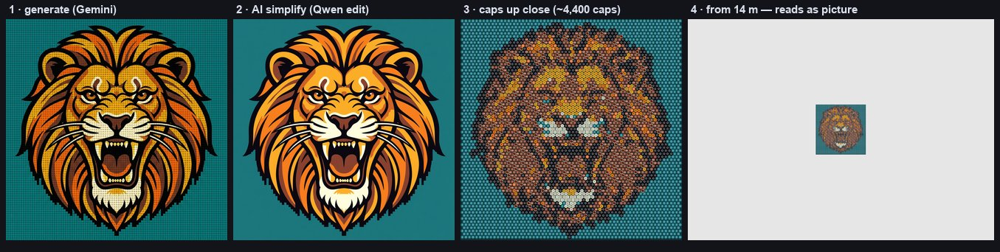
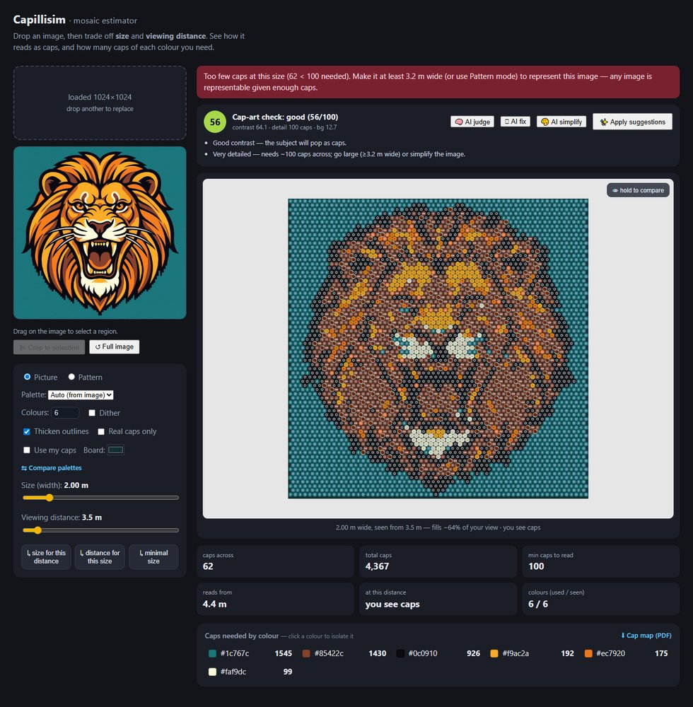
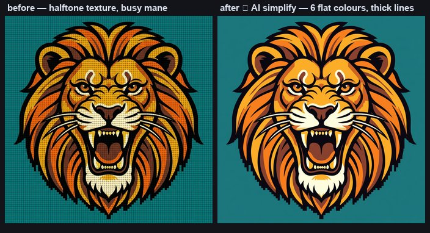
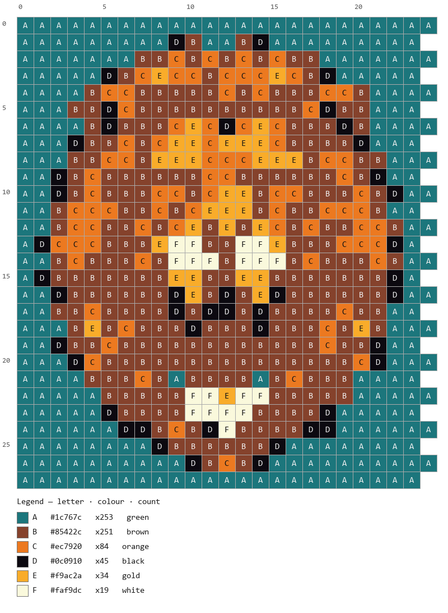
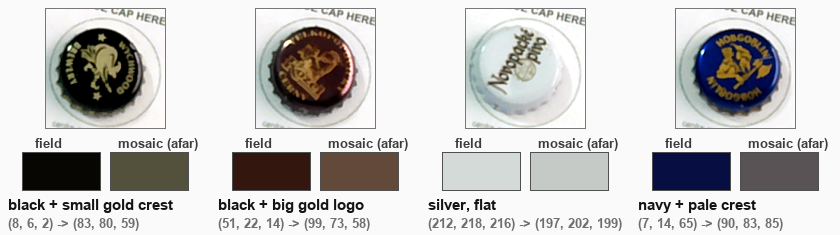

# Capillisim

*cap + pointillism* — because building a picture from discrete colored caps is
exactly what the pointillists did with dots.

Interactively build a mosaic out of bottle caps (mostly beer caps), guided by a
projector and a phone camera. You design a target image, the system computes the
cap layout at true real-world scale, and then — as you pick up each random cap —
it tells you the best empty slot (or that the cap doesn't help) and the projector
lights up that exact cell so you just drop the cap in place. The build happens in
stages over time; state persists between sessions.

This is a fresh project, independent of the personal-wiki repo it was sketched
in. See `docs/` for the full design.

## Cap recognition, live

Place a cap on the printed reading card — the scanner locates the card, colour-
corrects, reads both colours (field + mosaic-at-distance swatches on the right),
and auto-saves when the reading is stable. A hand in frame or glare gets
rejected and retried:

Every scanned cap also gets a rotation-invariant **ring signature**, so the
scanner recognises a cap it has seen before ("likely SAME design as cap #28")
and the inventory can be browsed by visual similarity:

## From any image to a buildable mosaic

The **Mosaic Estimator** web app (`PYTHONPATH=src python -m cap_mosaic.app.webapp`,
then http://127.0.0.1:8000/) takes any image — even one you just generated with
an LLM — and turns it into a physically buildable cap plan:

Everything happens in one screen: drop/paste an image, drag the **size** and
**viewing-distance** sliders, and watch the piece as caps up close vs a picture
from afar (perceptually correct: the mosaic *shrinks and stays sharp*, colours
mix in linear light — no fake blur):

Highlights (full walkthrough in **[docs/GUIDE.md](docs/GUIDE.md)**):

- **AI judge + one-click fixes** — a heuristic + Qwen-vision judge scores the
  image for cap-art suitability; `🪄 AI fix` applies its recommended settings
  (colours, thicken, size…), `🎨 AI simplify` rewrites the image itself into
  flat, thick-lined, cap-friendly art:

  
- **Build artifacts** — a printable paint-by-numbers **cap map** (PDF), a
  per-colour BOM with *have/short* from your scanned inventory, and projector
  **stencil / one-colour-at-a-time** modes for the physical build:

  

## Why this might be original

The mosaic-*generation* problem is well-solved (academic "structure-aware bottle
cap art", open-source generators, bead/cross-stitch tools). What does **not**
exist as a product is the interactive build loop: show an *arbitrary* cap to a
camera, have software match it to the best remaining slot or reject it, and have
a projector highlight that slot at 1:1 scale. That integration is the point of
this project. Details in `docs/PRIOR_ART.md`.

## Design decisions (locked)

- **Compute:** PC + phone for the POC (laptop drives projector + runs logic;
  phone streams its camera). Phone-only is a later goal, so the core logic is
  isolated for reuse.
- **Surface:** flat table, projector and phone looking straight down; caps
  removable until the final glue-down.
- **Caps:** open-ended / random supply. Matching tolerates "unknown cap, closest
  slot, or set aside."
- **Recognition:** dominant color for the POC; brand/logo ID architected but
  deferred.
- **Two colours per cap:** the *field* colour recognises a cap in hand; the
  *mosaic* colour — the linear-light mix of the whole face, logo included — is
  what the cap contributes to the picture from viewing distance, and is what
  the planner matches on. Real scanned caps:

  
- **Designer:** supports both simple patterns and photo/portrait mosaics, with a
  viewing-distance simulator to guide the trade-off.
- **Stack:** Python + OpenCV.

## Docs

- `docs/GUIDE.md` — **start here as a user:** the full illustrated guide — design, judge, simulate, print, project, build.
- `docs/RIG_SETUP.md` — **start here for the build:** boxes → calibration → live loop, with diagrams.
- `docs/PRIOR_ART.md` — what exists, what's novel.
- `docs/ARCHITECTURE.md` — components, data flow, the portable-core split, math.
- `docs/POC_OPERATION.md` — how projector + phone + PC connect and run the loop.
- `docs/CALIBRATION.md` — the projector→table calibration procedure (step by step).
- `docs/SIZING_AND_VIEWING.md` — piece size, cap count, and viewing distance.
- `docs/ESTIMATOR.md` — the web app: drag an image, trade off size ↔ distance, see the caps-vs-picture simulation and per-colour BOM.
- `docs/COLOR_MATCHING.md` — perceptual ΔE matching and the place-or-leave-empty threshold: research, anchors, calibration plan.
- `docs/DATA_MODEL.md` — the SQLite cap dataset/inventory schema (caps + crops + quality + busy-ness + future embeddings).
- `docs/HARDWARE.md` — the physical rig and the specs we still need.
- `docs/ROADMAP.md` — phased scope, milestones, and the POC success criteria.
- `docs/RESEARCH.md` — cap-image datasets to import and photomosaic/build techniques to adopt.
- `docs/HANDOFF.md` — current state + what's built vs pending (start here to resume).
