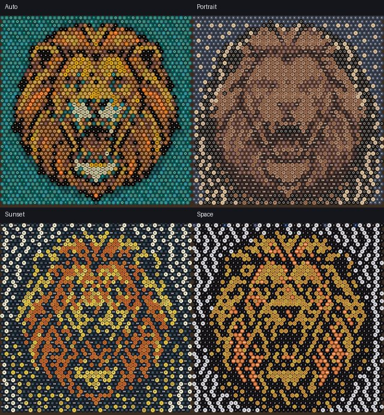
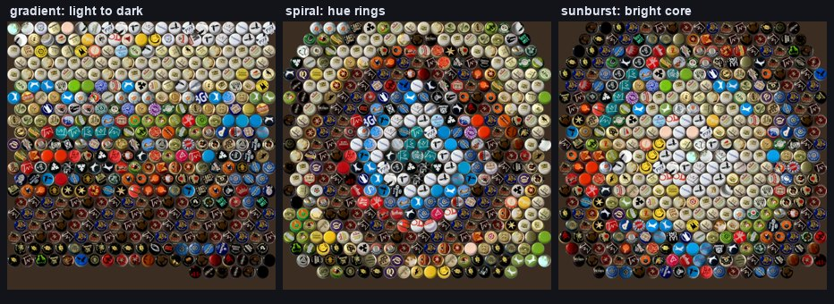

# Capillisim: The Full Guide

*From any picture to a wall of bottle caps.* This is the user-facing walkthrough
of the whole program: what it does, how to use each part, and how the pieces fit
into one pipeline. Architecture and rig details live in the other docs
(`ARCHITECTURE.md`, `RIG_SETUP.md`); this guide is about *using* it.

## The idea in one strip


A bottle cap is one fat pixel (~32 mm). Up close you see caps; from a few metres
the eye blends them into a picture. The steps between those two facts: choose
and fix the image, compute the cap layout at true physical scale, simulate how
it reads at any distance, list which caps to collect, and guide the placement
with a projector while you glue.

---

## 1 · Start the app

```bash
pip install -e .[web]                              # fastapi, uvicorn, multipart
PYTHONPATH=src python -m cap_mosaic.app.webapp     # -> http://127.0.0.1:8000
```

The app opens with a sample image already loaded, so every control below is
immediately clickable:


**Getting your image in:** drag & drop, click to browse, or just **Ctrl/Cmd+V**
paste from the clipboard. Drag a rectangle on the preview and hit **✂ Crop to
selection** to build from only part of it.

**Versions.** Every derived image (crops, AI edits) appears as a thumbnail in
the **version strip** under the preview (`Original · Crop · AI simplified`).
Click a thumbnail to switch the whole app to that version; the active one is
outlined; **⬇** on any tile saves that version as a file. Nothing is ever lost:
the original is always one click away.

---

## 2 · Is this a good image for caps? (the judges)

Cap art is a *shouting* medium: bold shapes, high contrast, few colours. Two
judges tell you where you stand the moment an image loads:

| Judge | What it is | What it's good at |
|---|---|---|
| **Cap-art check** (instant) | deterministic heuristics: contrast, detail floor (min caps-across for the subject to read at all), background busyness | the *numbers*: "this needs ≥3.2 m", "61 thin outline caps will vanish" |
| **🧠 AI judge** (one click) | Qwen vision model (`qwen3-vl-plus`) with a cap-art rubric | *taste*: knows a bold halftone poster is great even when the heuristic frets |

Then the two buttons that act on the verdict:

- **🪄 AI fix**: the AI judge returns machine-applicable settings (palette
  size, thicken, dither, physical size, palette preset; a fixed whitelist, it
  can't touch anything else). One click applies them and keeps a **before**
  snapshot next to the new simulation so you can compare.
- **🎨 AI simplify**: the AI edits *the image itself* (qwen-image-edit):
  flattens it to ≤6 poster colours, thickens hairlines, cleans the background:
  same subject, cap-friendly. The result lands as a new entry in the version
  strip. Switch back to the original (or save either) any time.


Real numbers from the lion above: the raw render needed **~11,400 caps** to
read; after AI simplify it reads at **~4,400**. The AI edit more than halved
the build.

> Needs `QWEEN_KEY` in the repo `.env` (DashScope). Without it, the heuristic
> judge and everything else still works; only the 🧠/🪄/🎨 buttons are AI.

---

## 3 · Size ↔ distance (the core trade-off)

Caps are fixed-size, so **physical width decides resolution**: a 2 m piece at
32 mm pitch is 62 caps across, full stop. The two sliders + three solver
buttons explore that:

- **Size (width)** / **Viewing distance** sliders: live update of everything.
- **↳ size for this distance**: how big must it be to fill your view from here?
- **↳ distance for this size**: where should you stand for this width?
- **↳ minimal size**: the smallest width that can represent this image at all
  (the legibility floor), plus the closest distance it reads from. Below that
  width, *no* distance saves it.

The stats row keeps score: caps across, total caps (background holes excluded:
what you'd actually buy), min caps to read, reads-from distance, and colours
*used vs seen* (far away, similar shades merge; the effective palette shrinks).

**How the distance simulation works.** Farther away, the piece *shrinks inside
a fixed field-of-view frame and stays sharp*: neighbouring caps merge through
linear-light area-resampling (the physics of colour mixing at a distance),
rather than an applied blur. Hold **👁 hold to compare** to flash the original
image with identical framing.

---

## 4 · Palette, dither, and the look

- **Palette**: *Auto* derives colours from the image (CIELAB k-means); the
  curated presets (*Portrait* 6-tone skin ramp, *Sunset*, *Space*) usually read
  bolder. **⇆ Compare palettes** renders all four side by side:

  
- **Colours**: the palette size (4–24). Fewer = bolder. Down-cluster before
  you doubt the subject.
- **Dither**: with few colours, per-cell nearest-colour banding is ugly;
  error-diffusion (CIELAB Floyd–Steinberg over the cap grid) mixes adjacent
  caps so gradients and skin tones read from distance. Turn it *off* for flat
  poster/pixel art (the AI judge does exactly that).
- **Thicken outlines**: 1-cap-wide strokes (whiskers, eyes, skylines) vanish
  from afar; this widens them to ≥2 caps. The warning banner tells you when
  it matters.
- **Board**: the backing-board colour (wood/paint/paper). Round caps leave
  gaps; the gaps and any background *holes* show this colour, so pick it like a
  real material. Near-white image areas become bare board automatically
  (`bare_white`), not white caps.

---

## 5 · Caps you actually own (inventory)

Scan caps with the reading card (`python -m cap_mosaic.app.cap_capture --out
dataset --auto`; see the README animation): each cap gets colour-corrected
crops, a field colour, a mosaic-at-distance colour, and a similarity signature
in `dataset/caps.db`.

In the estimator's **My scanned caps (N)** group:

- **Shopping list (have / short per colour)**: the BOM gains *have / short*
  per colour plus a total ("you own 218 of 4,367 needed"), your shopping list.
  Report only; the plan is never silently constrained.
- **Render using my caps' photos**: draw the simulation from your photographed
  caps (auto-cropped to uniform discs) instead of generated ones, for a preview
  in *your* caps.
- Click any BOM colour to **isolate** it: every other cap ghosts out so you
  see exactly where that colour goes.
- **Design from my caps (stock-limited)**: plan the whole mosaic from the caps
  you actually own. Duplicate designs (found by the scanner's ring signature)
  are pooled as interchangeable stock; a greedy global ΔE00 assignment spends
  duplicates where they fit best and sends scarce colours to their
  best-matching cells. Every cap is usable (no reject); when there are more
  cells than caps, the worst matches stay bare board. The readout shows
  "placing X of the N you own". If the subject needs more caps than you own,
  the result is honest about it: scan more caps or pick a bolder subject.
- **Patterns from my caps** (▤ Gradient / 🌀 Spiral / ☀ Sunburst): lay out the
  inventory ITSELF: every owned cap exactly once, zero colour error, always
  buildable. The result lands in the version strip like any image. A real
  416-cap inventory rendered as all three:

  
- **📋 AI prompt for my palette**: copies a generation prompt constrained to
  your dominant cap colours and total count; paste it into any image
  generator, then paste the result back into the app.

---

## 6 · Build it

Three artifacts take you from screen to board:

1. **⬇ Cap map (PDF)**, a printable paint-by-numbers sheet: one letter per
   colour in each cell, row/column rulers, and a legend with counts:

   

2. **Projector stencil**: with the projector rigged (see `RIG_SETUP.md` +
   `CALIBRATION.md`), project the plan at true 1:1 onto the board:

   ```bash
   PYTHONPATH=src python -m cap_mosaic.app.project_plan \
       --plan plans/lion.capproj.json --calibration calibration/table.json \
       --display-x 1920
   ```

   Keys: **S** = full colour stencil (drop each cap on its lit disc) ·
   **C/N/P** = one colour at a time, like muralists work: glue all of one
   colour, then the next · **Q** = quit.

3. **The interactive loop** (the project's heart, `run_build`): hold a random
   cap up to the camera → it reads the colour → matches the best empty cell
   (or says "set it aside") → the projector glows on that exact cell → drop it
   in. State persists between sessions; caps stay removable until the final
   glue-down.

---

## 7 · The full pipeline, end to end

```
 image (photo / pasted / Gemini-generated)
   │  judge: cap-art check + 🧠 AI judge
   │  fix:   🪄 apply settings · 🎨 AI simplify · ✂ crop
   ▼
 plan (size ↔ distance · palette · dither · thicken · bare-white holes)
   │  verify: live sim (shrink-not-blur) · 👁 compare · ⇆ palettes
   ▼
 caps (scan with the reading card → caps.db → have/short shopping list)
   │
   ▼
 build (⬇ cap map PDF · projector stencil / per-colour · interactive loop)
```

## Tips that make or break a piece

- **Bold beats accurate.** A slightly wrong colour with strong contrast reads
  better than the "right" colour that blends into its neighbour.
- **Never go below the floor.** If the app says "62 < 100 needed", the subject
  cannot read at that size; grow it or 🎨 simplify the image.
- **Outlines ≥ 2 caps.** Eyes, mouths, skylines: thicken or lose them.
- **Fewer colours than you think.** 6 well-chosen beats 12 similar.
- **Dark board hides sins.** Gaps between caps disappear on a dark background.
- **Great first subjects:** space/black-hole, sunsets, skulls/lions/logos,
  pixel-art. Faces want ≥50 caps across and a 6-tone portrait palette.

## Endpoint reference

Everything the UI does is a plain HTTP call, scriptable:

| Endpoint | Purpose |
|---|---|
| `POST /upload` | image → `{id, width, height, aspect}` |
| `GET /estimate` | size↔distance solve, legibility, BOM, inventory gap, thin-outline count |
| `GET /simulate` | the cap render (PNG): framed at distance, board colour, highlight, real caps |
| `GET /target` | the original with identical framing (A/B compare) |
| `GET /critique` | heuristic judge; `llm=true` adds the Qwen verdict + actions |
| `GET /simplify` | AI-edit the image into a cap-friendly copy (new id) |
| `GET /capmap` | paint-by-numbers sheet (`format=pdf\|png`) |
| `GET /palettes` | preset comparison sheet |
| `GET /crop`, `GET /image` | region crop, stored-image preview |

Parameter details in `ESTIMATOR.md`.
